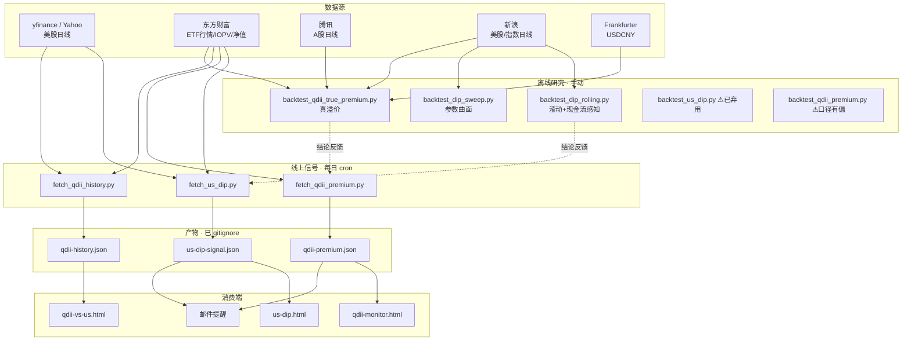

# 量化策略工具集：全景、口径与待办

这个目录里有两类脚本，混在一起容易搞错：

- **线上信号**（每天 cron 自动跑，产出 JSON 给网页和邮件）—— 决定"今天买不买"
- **离线研究**（手动跑，产出结论）—— 决定"这套规则到底值不值得用"

两者**必须共用同一套口径**，否则就会出现"用有偏的历史分布，去校准无偏的实时信号"这类错误（这已经发生过一次，见下方 QDII 溢价）。

---

## 1. 全景图



配置文件（**在 git 里，可直接改**）：

| 文件 | 作用 |
|---|---|
| `us_dip_watchlist.json` | 美股标的 + 回撤阶梯阈值 |
| `qdii_watchlist.json` | QDII 标的 + 分组 + 费率 |
| `qdii_email_recipients.txt` | 收件人与标签（`all` 每次发 / `us`、`qdii` 仅机会时发） |
| `qdii_email.env` | SMTP，**不在 git 里**，从 `.example` 复制 |

产物 JSON 与 `.bt_cache/` 都已 gitignore，避免服务器 `git pull` 时被覆盖。

---

## 2. 线上每日链路

服务器时区是 UTC，crontab 数字按 UTC 解释。

| 北京时间 | 触发 | 脚本 | 产物 → 页面 |
|---|---|---|---|
| 09:30 周二–周六 | `daily_us_dip_cron.sh` | `fetch_us_dip.py` | `us-dip-signal.json` → `us-dip.html` |
| 09:35 周一–周五 | `daily_qdii_cron.sh` | `fetch_qdii_premium.py` | `qdii-premium.json` → `qdii-monitor.html` |
| 同上（附带） | 同上 | `fetch_qdii_history.py` | `qdii-history.json` → `qdii-vs-us.html` |

错开 5 分钟是为了避免两个任务抢数据源。`fetch_qdii_history.py` 是慢变量且依赖 Yahoo，失败只记日志、不影响主流程。

手动试跑与安装命令写在两个 `.sh` 的头部注释里，包括 `--email-force` 强制发一封。

**线上信号的口径**：

- `fetch_us_dip.py`：`period="max"` 全历史取 ATH，用**盘中最高价**；`auto_adjust=False` 不复权。回撤 = (现价 − ATH) / ATH，按 watchlist 阶梯给"观望 / 分批买入 / 已到底档"。
- `fetch_qdii_premium.py`：用东财 **IOPV（f441）**，即估算净值，**口径本身是对的**。阈值 `<2% 可投 / 2–5% 谨慎 / >5% 不投`，并综合成交额（f6）、份额（f38）、市值（f20）给流动性档位。

---

## 3. 离线研究脚本

| 脚本 | 角色 | 状态 |
|---|---|---|
| `backtest_dip_rolling.py` | 阶梯 vs 定投，多起点滚动 + 现金流感知（新钱流入、股息再投、现金生息、费率、资金加权 IRR） | ✅ 现役 |
| `backtest_dip_sweep.py` | 参数曲面扫描，7 个因子 one-factor-at-a-time | ✅ 现役 |
| `backtest_qdii_true_premium.py` | 真溢价（估算净值口径）+ 净值滞后经验判定 + 新旧信号对比 | ✅ 现役 |
| `qdii_quant.py` | 场内 QDII 择时 13 条 + 选券 7 条 + 溢价证据 + 滚动窗口，已用真溢价口径 | ✅ 现役，周更 `qdii-quant.json` |
| `fetch_qdii_quant_data.py` | 上面那个的数据层：16 只的后复权价/不复权价/单位净值/累计净值 + QQQ/SPY/汇率/510880 | ✅ 现役 |
| `backtest_us_dip.py` | 旧的单起点阶梯回测 | ⚠️ 已弃用，四个缺陷见文件头 |
| `backtest_qdii_premium.py` | 旧的披露净值溢价回测 | ⚠️ 口径有偏，只能看趋势 |
| `fetch_qdii_history.py` | QDII 长期收益拆解（标的收益 + 汇率 − 费率 − 跟踪误差） | 🟡 骨架在，右边各项还没逐项量化 |

常用命令：

```bash
# 阶梯 vs 定投（标普500，187 个 10 年滚动窗口）
python backtest_dip_rolling.py --symbol SPY --report .bt_cache/rolling_spy.txt

# 复现旧脚本的 ATH 偏差，看差多少
python backtest_dip_rolling.py --symbol SPY --ath-mode window

# 参数曲面
python backtest_dip_sweep.py --report .bt_cache/sweep.txt

# QDII 真溢价 + 新旧对比
python backtest_qdii_true_premium.py --start 20250101 --report .bt_cache/tp.txt
```

Windows 控制台是 GBK 会把中文显示成乱码，所有脚本都支持 `--report` 输出 UTF-8 文本文件，看那个文件即可。

---

## 4. 数据源现状

**可用性因机器而异**，这是踩过的坑：

| 数据源 | 用途 | VPS | 本地 Windows |
|---|---|---|---|
| yfinance / Yahoo | 美股日线（线上信号主源） | ✅ | ❌ 403 |
| 东财 `push2his`（K线） | 美股/ETF 历史 | ✅ | ❌ 连接被断 |
| 东财 `push2delay` ulist | ETF 实时 + IOPV | ✅ | ✅ |
| 东财 `api.fund/f10/lsjz` | 基金历史净值 DWJZ/LJJZ | ✅ | ✅ |
| 东财 `pingzhongdata` | 累计净值走势 | ✅ | ✅ |
| 腾讯 `ifzq.gtimg.cn` | A股日线 | ✅ | ✅ |
| 腾讯 美股 | 美股日线 | — | ⚠️ 只返回边界行，不可用 |
| 新浪 `US_MinKService` | 美股/指数日线 | ✅ | ✅ |
| Frankfurter（ECB） | USDCNY 日度 | ✅ | ✅ |
| stooq / FRED | 备选 | — | ❌ 被挡/超时 |

**已知数据缺口（会影响结论，必须连同结果一起读）：**

- 新浪 `QQQ` **缺 2005–2010 整段**，不可用于回测；纳指改用 `.IXIC`（综指，2004 起完整）
- `SPY` 从 2001-01 起，`.IXIC` 从 2004-01 起 → **全样本都不含 2000-03~2002-10 完整的互联网泡沫破裂**。对"越跌越买"的策略来说，样本里缺了纳指史上最惨那次下跌，**真实最差情形一定比回测更差**
- 新浪美股日线**不复权**，股息用参数化年化股息率按季度模拟并再投（好处是能把价格回报和股息回报分开归因）
- 汇率用 ECB 口径，非在岸中间价，日度**变动**够用，绝对值有微小差异

---

## 5. 已确立的结论（别再重复踩）

### 5.1 QDII 溢价：净值参考的是当晚美股，不是前一晚

16 只标的一致判定，相关系数 **0.987~0.997**（错位一天则降到约 0）：净值(D) 参考"美股交易日 == D"那一场，即 D 当晚、收在 D+1 凌晨。而 A 股 D 日 15:00 收盘价还不知道当晚涨跌。

所以 `(收盘价 − 披露净值)/净值` 混入了整晚的标的波动：**美股当晚大涨 → 显示成"假折价"**（最危险，诱你在贵的时候买）。

最典型的一天，513100 / 2025-04-09（纳指当晚 +12%）：旧口径 **−6.00% 深折价**，真溢价 **+5.44%**，方向相反、差 11.4 个百分点。

修正后的影响：均值几乎不动（差 0.06pp），但**单日信号有 3.9%~13.4% 的交易日是错的**（16 只标的的中位约 9.5%；各标的 9~28 天假绿灯 + 6~25 天漏买，共 388 个交易日），且**偏差在高波动期最大**——恰好是最想加仓的时候。另外旧口径最深"折价" −9.35% 全是假的，真实最深折价只有 −1.62%。

顺带的市场事实：即使每天挑同组最便宜的那只，纳指组真溢价中位 **2.44%**、标普组 **1.85%**，可投日（<2%）只占 45%/52%。有美股账户的话，直接买 QQQ/VOO 优于走 QDII 通道。

### 5.2 回撤阶梯赚不到钱（SPY，2001–2026，187 个 10 年滚动起点）

| 策略 | 跑赢"全额立投"概率 | 中位超额 | 加权成本 vs 立投 |
|---|---|---|---|
| 12 个月摊平 | 32.1% | −1.72% | −1.67% |
| 纯阶梯 | **3.7%** | −3.91% | −1.02% |
| 定投+阶梯 | 28.9% | 0.00% | 0.00% |

最有说服力的一组数：阈值调深一倍后，成本确实低了 **3.71%**，但终值**落后 8.68%**。**买得便宜 ≠ 赚得多**，因为等待期间钱不在市场里。

结构性原因：**43.3% 的起点在第一天就已跌破最深一档**，阶梯当天全投，等于没择时。纳指更极端——综指从 2004 到 2015 一直在 2000 年顶之下，79.5% 的窗口里"等回撤"规则直接告诉你立刻全投。**这个策略只在市场不断创新高时才真让你等待，而那正是等待代价最大的时候。**

### 5.3 旧回测的四个缺陷各值多少

| 缺陷 | 影响 |
|---|---|
| re-arm 只认新高（长期水下断粮） | 阶梯劣势 −3.51% → **−8.61%**，是最大的单一缺陷 |
| 现金按 0 利息 | 现金年化 0%→4%，劣势 −4.96% → −2.80%（即旧口径**低估**了阶梯） |
| ATH 从窗口首日算 | 中位超额差 **2~3 个百分点**；旧口径宣称 100% 起点在高位，真实只有 25.1% |
| 单起点回测 | 187 个滚动起点后结论完全反转 |

### 5.4 方法学原则（对本人方案而言）

- **目标函数不是夏普**：股息永续、本金永不卖，所以任何"卖出信号"都不该进策略。择时只用于决定新钱何时进、进多少。
- **基准必须是定投，不是空仓**。很多策略赢了"不投资"却输给定投。
- **溢价对"永不卖出"的人只是成本过滤器，不是套利信号**。别用"溢价会回归"安慰自己，要用"今天这笔多付了几年费率"衡量：付 4% 溢价 ≈ 预付 5~8 年管理费。
- **新钱流入越多，攒钱等跌越亏**。每月新钱从 0 加到期初的 2%，阶梯劣势从 0 恶化到 −5.40%。

---

## 6. 口径一致性：已知的不一致

修完上面两项后，还剩这些线上与回测对不齐的地方，**这是下一步最该收的债**：

1. **ATH 用盘中最高 vs 收盘最高**：线上 `fetch_us_dip.py` 用 `High.max()`，回测用收盘价。线上读出的回撤会系统性更深，等于阶梯更容易触发。二者应统一（建议都用收盘，噪音更小）。
2. **复权 vs 不复权**：线上 `auto_adjust=False`，回测也不复权但用参数化股息补回。ATH 口径因此是"价格 ATH"而非总回报 ATH，长期会低估回撤幅度。
3. **年轻 ETF 的 ATH 不等于指数 ATH**：QQQM（2020 上市）、SPLG 等自上市以来的最高价，缺少更早的高点参照。同组内不同标的的"回撤"不可直接横向比较。
4. **QDII 真溢价还没进线上**：线上用 IOPV 是对的，但回测出的分位数（纳指组 P25 0.56%、标普组 0.21%）还没用来替换硬编码的 2%/5% 阈值。

`qdii_quant.py` 已经改成真溢价口径（净值参考时点用日收益相关性判定，16 只一致落在"含当晚行情"），顺手记下换口径带来的结论变化，**这是这笔债值多少钱的直接标价**：

| 结论 | 旧口径（收盘价÷披露净值） | 真溢价 |
|---|---|---|
| 溢价 >5% 买入，60 日超额 | −3.95%，胜率 11.8% | −3.60%，胜率 13.8% |
| 溢价 2~5% 买入，60 日超额 | −0.45%（看着该躲） | +0.08%（其实中性） |
| 折价买入，60 日超额 | +1.74%，胜率 80.5% | +0.98%，胜率 66.3% |
| "溢价<2%才买"跑赢定投的 3 年窗口 | 98%（纳指组） | 52%（纳指组）／88%（标普组） |

也就是说，**旧口径会让"低溢价才买"这条纪律看起来是一条稳定规律，真溢价下它退化成噪音**；反过来"别在 >5% 时买"这条底线两种口径都站得住。第 7 节第 2 项的价值主要在这里：有偏的历史会校准出过度自信的规则。

### 5.4 别把重叠窗口的胜率当把握（**对本仓库所有滚动回测都适用**）

追查上面那个 98% 时挖出来的第二个坑，比口径本身更普遍。相邻两个 3 年滚动窗口共享 35 个月的数据，所以「124 个窗口里 98% 跑赢」不是 124 份独立证据，**独立样本只有 4 段**。一个方向固定但幅度约等于零的偏移，在重叠口径下就会显示成压倒性优势：

| 规则（纳指组） | 重叠窗口胜率 | 不重叠 4 段 | 最差那段 |
|---|---|---|---|
| 旧口径溢价<2%才买 | 97.6% | 4/4 | **+0.02%**（等于零） |
| 真溢价<2%才买 | 52.4% | 2/4 | −0.55% |
| 定投+溢价止盈 | 65.3% | 4/4（标普组 0/4） | +0.13% |
| 200日线清仓择时 | 21.0% | 0/4 | −11.65% |

判据因此改成两条同时看：**不重叠窗口的胜负**，以及**两组标的是否同向**。按这个标准，只有"离开市场亏钱"（清仓择时、整仓轮动、追高）在两组共 8 段里全军覆没，是真结论；溢价纪律、止盈、阶梯全部两组反向，属噪音。

`backtest_dip_rolling.py` 的 187 个 10 年滚动窗口（SPY 2001–2026）有同样的问题——10 年窗口在 25 年历史里最多只有 2 段不重叠，所以第 5.2 节那几个胜率**只能读方向、不能读把握**。这是下次该给它补的东西。

---

## 7. 待办：把策略做全面（按性价比排序）

排序依据是"确定性 × 影响金额 ÷ 实现成本"。**前两项是白捡的，后面几项预测力递减**。

| # | 事项 | 为什么值得 | 成本 |
|---|---|---|---|
| 1 | **摩擦成本逐项量化**：用累计净值 vs `QQQ×汇率` 回归，算各 QDII **实测年化跟踪误差**并看稳定性；拆出费率、汇兑、税 | 每年 0.5%~1.5%，**几乎确定、可重复**。别只看宣称管理费——低费率基金跟踪差反而更大的情况很常见 | 中 |
| 2 | **统一口径**：收第 6 节的 4 笔债，把真溢价分位数接进线上阈值 | 消除"有偏历史校准无偏信号"这类错误，一次性 | 低 |
| 3 | **决策规则卡 + 接入邮件**：把已确立结论固化成机械规则（到账即投、阶梯仅 105 万额度、QDII 真溢价门槛），邮件直接给动作 | 结论只有进入日常流程才产生价值 | 低 |
| 4 | **QDII 溢价分制度性 / 波动性**：按限购状态、外汇额度分组统计。溢价**不一定回归**——额度用尽时可长期高企 | 决定"能不能等溢价下来"，直接影响是否放弃该通道 | 中 |
| 5 | **股息永续模拟器**：按目标函数直接算"股息覆盖开支的年份"分布，含 SCHD 占比路径、W-8BEN 10% 税、减息年份 | 这才是本人方案的真实目标函数，比终值 CAGR 更贴合 | 中 |
| 6 | **估值维度做对照**：加股权风险溢价（E/P − 10年期实际利率）或滚动 Z-score，与"纯回撤阶梯"和"200日均线"做 baseline 对照 | 必须有对照，否则不知道估值到底加了多少价值。**很可能答案是"几乎没有"——这个结论本身就省你以后折腾** | 高 |
| 7 | **补 2000–2002 数据**：找到能覆盖互联网泡沫的数据源，或用月度数据近似 | 补上样本里最惨的那次下跌，最差情形才可信 | 中 |
| 8 | **point-in-time 数据层**：统一复权口径、对齐时区与披露滞后、处理停牌缺失，禁止用今天的复权因子回推 | 是上面所有项的地基，越晚做越贵 | 高 |

---

## 8. 免责

仅供个人研究与交流，不构成投资建议。所有回测都是历史统计，样本有明确缺口（见第 4 节），历史不代表未来。
