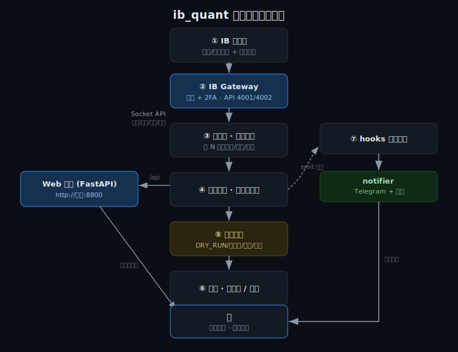

# 00 · 这套系统在干嘛（流程总览）

> 一句话：接入 IB（盈透证券），**自动盯盘 → 产生买卖信号 → 过安全护栏 → 下单（正股/期权）→ 全程通知你**。
> 看板页面就是它的实时窗口。先读这篇，再看具体操作文档。

---

## 架构图



## 整体数据流

```
①IB 子账户              开通正股/期权交易权限 + 订阅市场数据（见 01-account-setup.md）
      │
      ▼
②IB Gateway            用账号密码 + 2FA 登录，开放本地 API 端口 4001(实盘)/4002(模拟)
      │                （它替你管登录，程序不碰你的密码；见 02-api-deployment.md）
      ▼
③ib_quant 交易程序      连接 Gateway，每隔 POLL_INTERVAL_SECONDS 秒拉账户/持仓/行情
      │
      ▼
④策略轮询              策略算信号（示例：双均线金叉买/死叉卖；见 03-strategy-guide.md）
      │
      ▼
⑤安全护栏              DRY_RUN / 白名单 / 单笔金额 / 单标的持仓 / 单日笔数，任一不过→拒单
      │
      ▼
⑥下单                  DRY_RUN=true 只记录不发送；放开后发往模拟盘或实盘
      │
      ▼
⑦触达你                连接/信号/下单/成交/拒绝/异常/日报
                       → Telegram + 邮箱 + 看板「事件流」（同一份内容）
```

---

## 看板各切页

| 切页 | 内容 |
|------|------|
| 📖 说明 | 本流程图（页面默认页） |
| 📊 概览 | 账户净值、可用资金、未实现盈亏、当日下单数、护栏阈值 |
| 🧠 量化策略 | 启用的策略、标的池、最近信号 |
| 📦 持仓 | 当前正股/期权持仓与成本 |
| 🛒 手动下单 | 手动查价/下单测试（同样过护栏） |
| 🔔 事件流 | 所有事件时间线（= TG/邮箱推送内容） |

---

## 三种状态（看右上角徽章）

| 徽章 | 含义 |
|------|------|
| `DEMO/演示` | 未连后端，页面是静态示例数据，仅供看界面 |
| `PAPER` + `DRY_RUN` | 连模拟盘但不真实下单，跑通信号与通知（**推荐起步**） |
| `LIVE` | 实盘真实下单，需显式 `ALLOW_LIVE=true`，务必谨慎 |

---

## 我现在该怎么做

1. **看界面**：直接打开看板，默认显示演示数据，先熟悉布局。
2. **跑起来**：按 `02-api-deployment.md` 用 docker 启动，访问 `http://主机:8800`。
3. **先空跑**：`TRADING_MODE=paper` + `DRY_RUN=true`，观察策略信号和 Telegram/邮箱通知。
4. **再放开**：模拟盘真实下单 → 收紧护栏 → 实盘。

> ⚠️ 本系统会真实下单，仅供技术研究，不构成投资建议。
