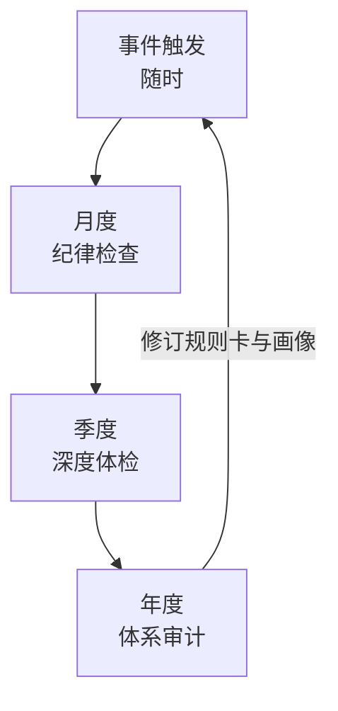

# 美股持仓复盘体系

个人美股组合的周期性复盘工具包。核心思路是**提示词与数据分离**：提示词长期稳定并持续迭代，每次复盘只更新持仓快照，这样既省事，也便于横向对比历史判断的准确率。

2026-08-01 首次深度复盘后扩展为四层结构：**记录层**（快照）、**规则层**（规则卡）、**认知层**（标的档案）、**追踪层**（决策日志）。加上原有的提示词，构成一个能跨年度累积的闭环。

> **版本管理**：本目录随 `telegram` 仓库一起做版本管理，`telegram` 是一个**公开仓库**。
> 这里几乎每个文件都含真实财务数据——账户净值、逐笔成本、期权义务、可投资本金，
> 新增内容时请知悉这一点。
>
> 好处是 `git log -- 美股持仓复盘/` 就是一部投资决策变更史：改了什么、什么时候改的、
> 为什么改，diff 里一目了然。这也是标的档案「只追加不改写」、决策日志「不许改写当初的理由」
> 两条纪律的技术保障——真要事后粉饰，记录会留下痕迹。

## 投资者画像（所有提示词的共同前提）

| 项目 | 内容 |
|------|------|
| 年龄 / 周期 | 42 岁，投资周期 15–20 年 |
| 资金规模 | 全部美股账户合计约 110 万美元（**多账户，规则以合并口径为准**） |
| 市场范围 | 仅美股（含在美上市 ADR） |
| 风格 | 积极进取型，偏好科技：半导体、AI 基础设施、软件/SaaS、平台互联网 |
| 核心纪律 | **不追高**——不在 52 周高点附近且估值处于历史高分位时买入，不因 FOMO 加仓，宁可持有现金等待 |
| 常用工具 | Sell Put 在认可价位接货、Covered Call 收租；不做裸买期权、杠杆 ETF、日内交易、融资杠杆 |

> 画像每年至少校准一次（年度审计的第 6 节）。**声明和事实是两回事**——2026-08-01 复盘发现，
> 画像里写的「不加融资杠杆」与实际持仓（无现金担保的裸卖 Put，等于隐性杠杆）并不一致。
> 每次复盘都要核对声明与事实，不要因为写在画像里就假定它成立。

## 文件索引

### 提示词（按复盘层级）

| 文件 | 用途 | 频率 |
|------|------|------|
| [美股持仓深度分析提示词.md](./美股持仓深度分析提示词.md) | 组合全面体检：暴露拆解、逐股诊断、期权敞口审查、压力测试、目标配置、行动清单 | 每季度 |
| [月度快速复盘提示词.md](./月度快速复盘提示词.md) | 轻量体检：变化清单、纪律检查、本月动作 | 每月 |
| [年度审计提示词.md](./年度审计提示词.md) | 业绩归因、判断准确率统计、画像校准、税务汇率、规则卡修订 | 每年 |

### 长期文件（跨期连续，不重建）

| 文件 | 作用 |
|------|------|
| [投资规则卡.md](./投资规则卡.md) | 把口头纪律翻译成可机械检查的数字阈值。每次复盘照着填、超限即红牌 |
| [主动策略-回撤响应阶梯.md](./主动策略-回撤响应阶梯.md) | 体系的「进攻」半边：现金担保卖 put 引擎、21–45 DTE 机械规则、越跌越买的回撤响应阶梯 |
| [标的档案/](./标的档案/) | 已买入持仓的认知档案；其子目录 [预选标的/](./标的档案/预选标的/) 放尚未建仓的研究候选（转正时上移到本目录） |
| [期权专题/](./期权专题/) | 期权策略调研与议题讨论区：主流策略全景、实证证据档案、**本组合策略白名单裁决**。只出策略判断与规则建议，不下单、不改规则卡 |
| [playbooks/](./playbooks/) | 按标的的期权执行手册：估值底测算、卖 Put 建仓、Covered Call 轮动、展期与止损规则 |
| [决策日志.md](./决策日志.md) | 所有「等回调再买」类判断的记录与事后核对，累计出判断准确率与执行率 |

### 每期文件

| 文件 | 作用 |
|------|------|
| [持仓快照-模板.md](./持仓快照-模板.md) | 填写持仓数据的模板，三份提示词共用 |
| [历史复盘/](./历史复盘/) | 存放填好的历史快照与复盘报告 |

### 工具

| 文件 | 作用 |
|------|------|
| [tools/](./tools/) | 从 IB Gateway 只读拉取持仓、自动生成快照的脚本。穿透暴露、期权名义敞口、到期集中度全部自动算好，投资逻辑与期权意图仍需手填 |

### 站点（文档中心）

| 文件 | 作用 |
|------|------|
| [站点架构.md](./站点架构.md) | **改站/加内容时先读这个**：生成链路、目录职责、标准操作、给 AI 的短指令。线上地址 `learn.tgfootclub.com/portfolio/` |
| [站点/index.html](./站点/index.html) | 由 `tools/build_site.py` 从本目录全部 Markdown 打包生成的自包含单页；改文档后必须重跑脚本 |
| [../网站架构与内容维护指南.md](../网站架构与内容维护指南.md) | 三站总览与服务器部署（nginx / cron） |

## 四层复盘节奏

原来只有月度和季度两层。实践发现两个缺口：期权头寸的处理线可能在任何一天触发，等不到月底；
而跨年度的业绩归因和规则修订，季度视角又做不了。所以扩展为四层。

| 层级 | 触发条件 | 用什么 | 产出 |
|------|----------|--------|------|
| **事件触发** | 期权浮亏达 100%、单票单周跌超 20%、失效条件被触发、保证金占用超净值 25%、指数自高点回撤超 15% | 针对性处理 | 更新决策日志与规则卡状态 |
| **月度** | 每月 | 月度提示词 | 变化清单、纪律检查、本月动作 |
| **季度** | 每季，或市场剧烈变化时 | 深度提示词 | 完整复盘报告 |
| **年度** | 每年 12 月下旬 | 年度审计提示词 | 准确率统计、画像校准、规则卡修订 |

## 复盘流程

1. 复制 `持仓快照-模板.md` 到 `历史复盘/`，重命名为 `持仓快照-YYYY-MM-DD.md`。
   或者直接跑 `python tools/generate_snapshot.py`，从 IB 拉数据自动生成（见 [tools/README.md](./tools/README.md)）。
2. 填写数据。三处要点：
   - **必须用合并口径**（全部美股账户）。单账户口径会同时高估期权敞口比例、低估个股穿透集中度。
   - **期权必须填「意图」和「名义金额」两列**。持仓界面只显示期权市值（几千美元），完全看不见背后的名义敞口（可能几十万美元）。
   - **「我的一句话投资逻辑」自己写**，不要让 AI 代写。它是下次判断逻辑是否走坏的唯一基准。
3. 填完快照第 8 节的规则卡合规自检表。这一步是机械的，只需填数字和比大小，不需要判断。
4. 选提示词：事件触发按情况处理，月度用精简版，季度用深度版，年度用审计版。
   把提示词正文（`▼▼▼` 与 `▲▲▲` 之间）整段复制，连同快照、规则卡、决策日志一起发给 AI。
5. 建议使用带联网搜索能力的模型，否则估值分位、52 周高点等数据会失真；无论如何都要自行核对关键价格。
6. AI 输出存回 `历史复盘/`，命名为 `复盘报告-YYYY-MM-DD.md`。
7. 把新产生的判断抄进 `决策日志.md`，把失效条件的最新值更新到对应的 `标的档案/`。

**每次复盘的第一件事，是核对上期决策日志里所有「等待中」的条目。** 不是产生新分析。

## 与 playbooks 的关系（2026-08-01 修正）

[playbooks/](./playbooks/) 是单只标的的期权执行手册。它原本放在同级的 `ib_quant/playbooks/`（量化交易模块），
但那是量化交易程序的代码目录，而这些手册是投资决策文档、程序也从未引用过它们，
所以 2026-08-01 一并迁入本目录，与标的档案、规则卡、决策日志形成闭环。

各文件各管一段，顺序不能颠倒：

| 文件 | 回答的问题 |
|------|-----------|
| `标的档案/<代码>.md` | （已买入）我为什么持有它？什么情况下承认自己错了？合理买入区间是多少？ |
| `标的档案/预选标的/<代码>.md` | （未建仓）要不要买？和现有 AI 赌注是稀释还是加强？买区草稿是多少？ |
| `期权专题/` | 在这个标的上该用哪种期权结构？为什么不用另一种？（策略层，输出白名单与规则建议） |
| `投资规则卡.md` | 这个仓位能开多大？这个行权价合规吗？什么情况下必须动手？ |
| `playbooks/<代码>-*.md` | 具体挂什么行权价、什么到期周期、被行权后怎么办、什么时候展期 |
| `决策日志.md` | 手册里的规则，我到底执行了没有？ |

**playbook 的行权价选择要以标的档案里的「合理买入区间上限」为输入。** 没有那个数字，
行权价就没有锚，只能凭盘面感觉挂单——这正是 2026-08-01 复盘发现的问题根源。
规则卡第 F1 条因此要求：任何新建仓之前必须先有标的档案。

还有一件事此前没有写清楚，导致了实际操作中的偏差：

> **飞轮策略（Sell Put → 持股 → Covered Call）以「愿意且有能力接货」为前提。**
> 如果实际上从不打算接货、也没有接货所需的现金，那么飞轮就只剩第一步，
> 而单独的第一步在无现金担保时就是**裸卖 Put**——这与画像里「不做裸买期权、不加融资杠杆」直接冲突。

两类 Sell Put 必须分开管理，规则卡第 3.1 节有完整定义：

| | 接货型 | 收租型 |
|---|---|---|
| 最坏结果 | 以认可的价格买到好公司 | 在暴跌中用高价现金平仓，不留任何资产 |
| 本质 | 买入纪律的执行工具 | 做空波动率 |
| 担保 | 必须 100% 现金担保 | 保证金担保，但需备平仓弹药 |

QCOM 和 NVDA 的手册是**接货型飞轮**，DRAM 的手册明确写着是**波动率投机**（其第七节原文：「这不是飞轮，是波动率投机」）。三份手册本身都写得很清醒，混用是使用方式的问题，不是手册的问题。

首次复盘逐条核对后发现，三份手册里共有**六条机械规则已经触发但从未执行**，明细见 [playbooks/README.md](./playbooks/README.md)。每次复盘都要重做这个核对。

## 迭代方式

这套体系的价值取决于持续修正。发现 AI 答得跑偏、漏掉你关心的角度，或纪律标准变化时，直接改对应章节，并在文件顶部的变更记录里登记一行。

**规则卡有一条额外的修订纪律**：只能在季度或年度复盘时修改，**绝不允许在想做某笔交易的当下修改规则来让这笔交易合规**——那等于没有规则。

## 首次复盘的主要发现（2026-08-01）

留在这里作为体系设计意图的说明，也作为下次复盘的对照起点：

1. **策略定义漂移**：文档写的是现金担保接货，实际执行的是保证金裸卖收租，现金缺口 325,863 美元。
2. **Sell Put 正在绕过「不追高」纪律**：SPYM 86 Put 行权价距 52 周高点仅 3.9%，实质是延后执行的追高单。
3. **穿透后极度集中**：QQQM 与 IQQ 跟踪同一指数；穿透后 MSFT 25.3%、半导体 35.5%；现金 0.01%，防守型资产 3.7% 且全部为 ETF 附带。
4. **六条自己写的 playbook 规则全部未执行**：问题不在认知层面，在缺少定期比对的机制。这是规则卡与合规自检表存在的全部理由。

完整内容见 [历史复盘/复盘报告-2026-08-01.md](./历史复盘/复盘报告-2026-08-01.md)。

> ⚠️ 本目录所有文档仅供个人信息参考，不构成投资建议。
