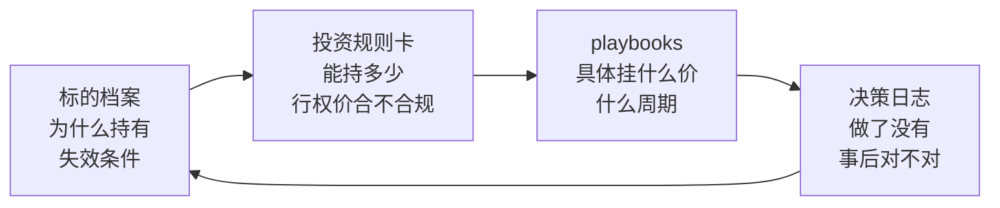

# 个股策略操作手册（Playbooks）

本目录收录**按标的整理的期权执行手册**，每份对应一只标的的完整打法：估值底测算、卖 Put 建仓、Covered Call 轮动、展期规则、风控与执行清单。

> **2026-08-01 从 `telegram/ib_quant/playbooks/` 迁移至此。**
> 原位置是量化交易程序的代码目录，但这些手册是投资决策文档而非代码资产，
> ib_quant 的程序也从未引用过它们。放在复盘体系里，它们才能和标的档案、规则卡、决策日志形成闭环。

## 在整套体系里的位置



| 文件 | 回答的问题 |
|------|-----------|
| `../标的档案/<代码>.md` | 我为什么持有它？什么情况下承认自己错了？合理买入区间是多少？ |
| `../投资规则卡.md` | 这个仓位能开多大？这个行权价合规吗？什么情况下必须动手？ |
| **本目录** | **具体挂什么行权价、什么到期周期、被行权后怎么办、什么时候展期** |
| `../决策日志.md` | 手册里的规则，我到底执行了没有？ |

**顺序不能颠倒。** 规则卡第 F1 条：任何新建仓之前必须先有标的档案，
因为 playbook 的行权价选择要以档案里的「合理买入区间上限」为输入。
没有那个数字，行权价就没有锚，只能凭盘面感觉挂单——这正是 2026-08-01 复盘发现的问题根源。

## 手册索引

| 标的 | 文件 | 策略 | 类型 | 配套标的档案 | 状态 |
|------|------|------|------|--------------|------|
| QCOM 高通 | [QCOM-飞轮策略操作手册.md](./QCOM-飞轮策略操作手册.md) | 飞轮（Sell Put → 持股 → Covered Call） | 核心·投资 | [QCOM.md](../标的档案/QCOM.md) | 已完成 |
| NVDA 英伟达 | [NVDA-飞轮策略操作手册.md](./NVDA-飞轮策略操作手册.md) | 飞轮，中近虚值收肥权利金 | 核心·投资 | [NVDA.md](../标的档案/NVDA.md) | 已完成 |
| DRAM 存储ETF | [DRAM-波动率收割操作手册.md](./DRAM-波动率收割操作手册.md) | 深虚值 Sell Put 收割极端 IV | **卫星·投机** | [ETF-宽基与主题.md](../标的档案/ETF-宽基与主题.md) | 已完成 |
| 组合（SPY/QQQ/科技） | [组合-满仓卖Put引擎操作手册.md](./组合-满仓卖Put引擎操作手册.md) | 满仓（0%现金）30SPY+50QQQ+20%科技 + 融资卖 Put 引擎 | **组合·进取** | — | 已完成 |
| MSFT 微软 | 待补充 | 备兑修复 | 核心·投资 | [MSFT.md](../标的档案/MSFT.md) | 计划中 |

## 飞轮策略的前提：必须真的愿意且有能力接货

这一条此前没有写清楚，导致了实际操作中的偏差，2026-08-01 复盘时补上。

飞轮（Sell Put → 持股 → Covered Call）的第二步和第三步都以**接货**为前提。
如果实际上从不打算接货、也没有接货所需的现金，那么飞轮就只剩第一步，
而单独的第一步在无现金担保时就是**裸卖 Put**——这与投资者画像里「不做裸买期权、不加融资杠杆」直接冲突。

所以两类 Sell Put 必须分开管理（完整定义见规则卡第 3.1 节）：

| | 接货型 | 收租型 |
|---|---|---|
| 最坏结果 | 以认可的价格买到好公司 | 在暴跌中用高价现金平仓，不留任何资产 |
| 本质 | 买入纪律的执行工具 | 做空波动率 |
| 担保 | **必须 100% 现金担保** | 保证金担保，但需备平仓弹药 |
| 适用手册 | QCOM、NVDA 飞轮 | DRAM 波动率收割 |

**QCOM 和 NVDA 的手册是接货型飞轮，DRAM 的手册是波动率投机**（其第七节原文：「这不是飞轮，是波动率投机」）。
三份手册本身都写得很清醒，混用是使用方式的问题，不是手册的问题。

## 2026-08-01 复盘发现：六条规则触发未执行

这些手册的判断质量不是问题，**执行才是**。首次深度复盘逐条核对后发现：

| 手册出处 | 规则原文 | 触发情况 | 执行 |
|----------|----------|----------|------|
| QCOM 第八节 | 「一旦放量跌破 175 铁底，立即买平当月 Put……**绝不死扛等被行权**」 | QCOM 自 189 跌至约 145–150 | 未执行，权利金浮亏 -101.3% |
| QCOM 第十一节 | 「权利金缩水 50–60% → 止盈平仓滚动」 | — | 方向相反 |
| QCOM 第九节 | 「保留充足现金/短债（如 SGOV）作为波动率飙升时的缓冲弹药」 | 持续 | 未执行，账户现金 37.06 美元 |
| DRAM 第六节 | 「正股放量跌破关键均线即平仓认亏，**不接货长拿**」 | 正股自约 70 跌至 49.80 | 未执行，浮亏 -80.1% |
| DRAM 第六节 | Sell Put「深虚值，离现价 -25% 以上」 | 55 Put 开仓时约 -21% | 已实值 5.2 |
| DRAM 第七节 | 「被行权后尽快了结，**不当长期底仓持有**」 | — | 持有 100 股，浮亏 -18.5% |

结论：缺的不是纪律条文，是**定期把条文和当前数字放在一起比对的动作**。
这正是 [投资规则卡.md](../投资规则卡.md) 第 3.4 节强制处理线、
以及快照第 8 节合规自检表存在的全部理由。**每次复盘必须逐条核对本表格式的内容。**

## 命名规范

```
<TICKER>-<策略名>操作手册.md
```

## 通用结构模板

每份手册建议包含以下章节，便于横向对照：

1. 核心结论速览
2. 基本面锚点（实时数据）
3. 价格底部测算（多方法交叉验证）— **产出的价值底要同步填进标的档案的「合理买入区间上限」**
4. 第一步：卖出看跌期权（Sell Put 建仓）— **行权价必须先过规则卡 3.3 节的三关**
5. 第二步：若被行权（持股后成本管理）
6. 第三步：卖出备兑看涨（Covered Call 收租）
7. 展期规则（Roll Up & Out / Roll Down & Out）
8. 风险管理（Vega 总量、行业集中度、IV 性质、财报日历）
9. 关键价位速查表
10. 操作清单（Checklist）— **其中的机械触发条件要同步抄进规则卡 3.4 节**

## 维护

手册里的价格与估值会过期（现有三份的基准日期都是 2026 年 6 月底至 7 月中）。
建议每季度深度复盘时，连同标的档案一起更新一次基准数据，并在文件头部标注最后更新日期。

> ⚠️ 本目录所有文档仅供信息参考，不构成投资建议。
