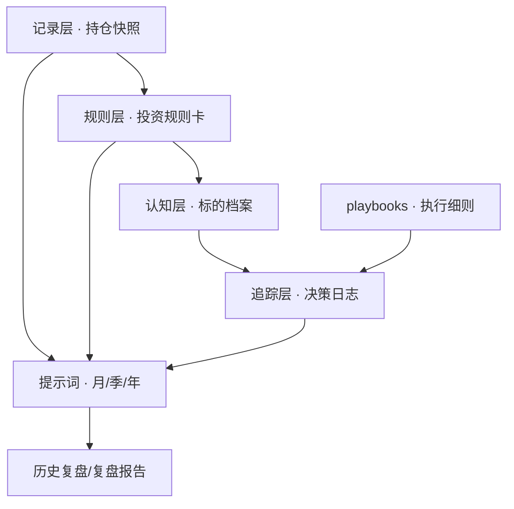

# 美股持仓复盘 · 站点架构与维护指南

> **给 AI / 给未来的自己**：改这个站时，先读本文，不必再写长提示词。
> 内容改 Markdown → 跑生成脚本 → 提交推送即可。

| 项 | 值 |
|----|----|
| 线上地址 | https://learn.tgfootclub.com/portfolio/ |
| 产物 | `站点/index.html`（自包含单页，约数百 KB～数 MB） |
| 生成器 | `tools/build_site.py` |
| 内容源 | 本目录下全部 `*.md`（跳过 `站点/` 与隐藏目录） |
| 部署 | 随 `telegram` 仓库 `git push`；服务器 cron 每 3 分钟 `git pull` |
| 隐私 | **公开访问，含真实财务数据**（净值、成本、期权义务） |

部署细节（nginx 软链、密码墙）见上级文档：[网站架构与内容维护指南.md](../网站架构与内容维护指南.md) 第四节。

---

## 1. 一句话架构

```
Markdown 文档（真相源）
        │
        ▼
tools/build_site.py   ← 扫描 / 分组 / base64 内嵌 / 注入 HTML 模板
        │
        ▼
站点/index.html        ← 双击可离线打开；也可挂到 /portfolio/
        │
        ▼
浏览器：侧边栏导航 + marked.js 渲染 + hash 路由
```

**原则**：站点只做「查看器」，不硬编码任何行情或持仓数字。数字只存在于 Markdown；文档改了必须重跑生成脚本，否则线上仍是旧内容。

---

## 2. 目录与职责

```
美股持仓复盘/
├── README.md                 # 复盘体系总说明（投资者画像、四层节奏）
├── 站点架构.md               # 本文：站点怎么建、怎么改、怎么发
├── 投资规则卡.md             # 可机械检查的数字阈值
├── 决策日志.md               # 「等待中」判断的追踪与事后核对
├── 主动策略-回撤响应阶梯.md
├── 持仓快照-模板.md
├── *提示词.md                # 月度 / 季度 / 年度复盘提示词
├── 标的档案/                 # 已买入持仓（站内：标的档案）
│   └── 预选标的/             # 尚未建仓的研究候选（站内：预选标的）
├── playbooks/                # 期权执行手册（站内分组名：操作手册）
├── 期权专题/                 # 期权策略调研与议题讨论区（README 为议题看板）
├── 历史复盘/                 # 填好的快照 + 复盘报告
├── tools/
│   ├── build_site.py         # ★ 站点生成器（唯一构建入口）
│   ├── generate_snapshot.py  # 从 IB 拉持仓生成快照（与站点无关）
│   └── …
└── 站点/
    └── index.html            # ★ 生成产物，勿手工大改正文内容
```

| 你要改的东西 | 改哪里 | 然后 |
|-------------|--------|------|
| 文档正文、规则、档案、复盘报告 | 对应 `.md` | `python3 tools/build_site.py` |
| 侧边栏分组名 / 排序 | `tools/build_site.py` 里 `GROUP_ORDER` / `CORE_ORDER` / `SYMBOL_ORDER` / `CANDIDATE_ORDER` / `classify()` | 重跑脚本 |
| 页面壳子（样式、布局、搜索、移动端） | `build_site.py` 里的 `HTML_TEMPLATE` 字符串 | 重跑脚本 |
| 持仓数据本身 | `历史复盘/持仓快照-*.md` 或跑 `generate_snapshot.py` | 重跑 `build_site.py` |
| 上线 | —— | `git add` → `commit` → `push`（等 cron 或手动 pull） |

**不要**直接编辑 `站点/index.html` 里的文档正文（那是 base64 内嵌的生成结果，下次构建会被覆盖）。若只改壳子/交互，改 `HTML_TEMPLATE`。

---

## 3. 生成器逻辑（`build_site.py`）

### 3.1 收录规则

- `ROOT.rglob("*.md")`，根目录 = `美股持仓复盘/`
- 跳过：`站点/` 下的文件、任意以 `.` 开头的路径段
- 每篇产出一条：`{id, title, group, group_order, order, path, b64}`
  - `id` / `path`：相对路径，正斜杠（如 `标的档案/MSFT.md`）
  - `title`：正文第一个 `# ` 标题，否则用文件名
  - `b64`：UTF-8 原文的 base64（解决 `file://` 下 fetch 跨域，实现双击离线打开）

### 3.2 侧边栏分组（`classify()`）

| 分组 | 如何判定 | 组内排序 |
|------|----------|----------|
| 核心文档 | 顶层 md，且文件名不含「提示词」「模板」 | `CORE_ORDER` 优先，其余按文件名 |
| 标的档案 | `标的档案/*.md`（已买入，不含子目录） | `SYMBOL_ORDER`（按穿透仓位大致顺序） |
| 预选标的 | `标的档案/预选标的/`（研究候选） | `CANDIDATE_ORDER` |
| 操作手册 | `playbooks/` | 文件名 |
| 期权专题 | `期权专题/` | `README.md` 置顶（`OPTIONS_ORDER`），其余按文件名编号 |
| 历史复盘 | `历史复盘/` | 文件名里的日期**倒序**（新的在前） |
| 提示词与模板 | 顶层且文件名含「提示词」或「模板」 | 文件名 |
| 工具 | `tools/` 下的 md | 文件名 |
| 其他 | 其余 | 文件名 |

新增分组：改 `GROUP_ORDER` + `classify()` 分支，再重跑。

### 3.3 HTML 模板要点

- 依赖：CDN `marked.min.js`（GFM Markdown → HTML）
- 布局：左侧栏（品牌 + 搜索 + 分组导航）+ 主区（面包屑路径 + 正文）
- 路由：`location.hash = #encodeURIComponent(doc.id)`，`hashchange` 时 `render`
- 站内链接：渲染后把指向已收录 md 的相对链接改写成 `#hash`（`rewriteLinks`）
- 搜索：只过滤侧边栏标题/路径，不搜正文
- 移动端：`<820px` 侧边栏抽屉 + backdrop
- 占位符：`__DOCS_JSON__`（文档数组）、`__GEN_TIME__`（生成时间）

### 3.4 构建命令

```bash
cd 美股持仓复盘   # 或在仓库任意位置用完整路径
python3 tools/build_site.py
# ✅ 站点已生成：…/站点/index.html
#    收录文档 N 篇，分组：…
```

本地预览：双击 `站点/index.html`，或任意静态服务器指向 `站点/`。

---

## 4. 内容体系（站点在展示什么）

站点展示的是整套「提示词与数据分离」的复盘体系，不是交易程序。



四层复盘节奏（事件 → 月度 → 季度 → 年度）与文件职责见 [README.md](./README.md)。

文档间顺序（不能颠倒）：

1. `标的档案/<代码>.md` — 为什么持有、失效条件、合理买入区间  
2. `期权专题/` — 该用哪种期权结构（白名单裁决），以及为什么不用另一种  
3. `投资规则卡.md` — 能开多大、行权价是否合规  
4. `playbooks/<代码>-*.md` — 挂什么价、什么周期、展期/止损  
5. `决策日志.md` — 手册规则有没有执行  

> `期权专题/` 只产出**策略层裁决**（白名单 / 观察 / 禁用）与给规则卡的条款建议，
> 不下单、不改规则卡。裁决落地必须走规则卡 F5（只能在季度或年度复盘时修订）。

---

## 5. 标准操作（复制即用）

### 5.1 只改文档并上线

```bash
# 1. 编辑任意 .md（如 决策日志.md、标的档案/MSFT.md、历史复盘/…）
# 2. 重新打包站点
python3 tools/build_site.py
# 3. 提交（含 md + 生成后的 站点/index.html）
git add 美股持仓复盘/
git commit -m "portfolio: 更新复盘文档"
git push
# 4. 最多约 3 分钟自动上线；浏览器 Cmd+Shift+R 强刷
```

### 5.2 新增一只标的档案（已买入）

1. 复制 `标的档案/_模板.md` → `标的档案/XXXX.md`，填好逻辑与失效条件  
2. （可选）在 `build_site.py` 的 `SYMBOL_ORDER` 里插入文件名，控制侧边栏位置  
3. `python3 tools/build_site.py` → 提交推送  

若从预选转正：把 `标的档案/预选标的/XXXX.md` 上移到 `标的档案/XXXX.md`，补全买区与失效条件，并从 `CANDIDATE_ORDER` 挪到 `SYMBOL_ORDER`。

### 5.2b 新增一只预选标的

1. 在 `标的档案/预选标的/` 新建 `XXXX.md`（可参考同目录已有档案），并更新 `候选清单.md` 索引表  
2. （可选）在 `CANDIDATE_ORDER` 插入文件名  
3. 重跑 `build_site.py`  

### 5.3 新增一份 playbook

1. 在 `playbooks/` 新建 `XXXX-….md`，并在 `playbooks/README.md` 索引表加一行  
2. 重跑 `build_site.py` → 提交  

### 5.3b 期权专题讨论区加一条议题 / 一篇调研

1. 在 [`期权专题/README.md`](./期权专题/README.md) 的**议题看板**加一行（编号 `Q0xx`、状态、一句话结论、去处）  
2. 展开的裁决写进 [`期权专题/07-议题裁决-本组合白名单.md`](./期权专题/07-议题裁决-本组合白名单.md)；
   引用到的数字先进 [`06-实证证据档案.md`](./期权专题/06-实证证据档案.md)（**必须带样本期与来源**）  
3. 若新增独立文件，命名 `NN-主题.md`（编号递增即可，无需改 `build_site.py`；`OPTIONS_ORDER` 只固定 README 置顶）  
4. 重跑 `build_site.py` → 提交  

> 纪律：议题**只追加不改写**（结论变了加新日期记录）；裁决要变成规则必须等季度复盘。

### 5.4 新增一期复盘

1. 用模板或 `python tools/generate_snapshot.py` 生成 `历史复盘/持仓快照-YYYY-MM-DD.md`  
2. 手填逻辑/意图/规则卡自检 → 用对应提示词出报告 → 存 `历史复盘/复盘报告-YYYY-MM-DD.md`  
3. 更新决策日志与相关标的档案  
4. `python3 tools/build_site.py` → 提交  

### 5.5 改站点 UI / 交互

只改 `tools/build_site.py` 的 `HTML_TEMPLATE`（CSS 变量、布局、搜索、colorize 规则等），然后重跑脚本。不要手改产物里的文档 JSON。

---

## 6. 给 AI 的最短指令模板

以后开新对话改这个站，用下面任一条即可（附上本文路径）：

```
请先读 美股持仓复盘/站点架构.md，再按其中标准操作执行：
- 改了这些 md：…
- 需要重跑 build_site.py 并确认站点/index.html 已更新
- 不要手改 index.html 里的正文；壳子改动只动 HTML_TEMPLATE
```

或：

```
@美股持仓复盘/站点架构.md
在标的档案新增 XXX，并重建站点。
```

---

## 7. 常见坑

| 现象 | 原因 | 处理 |
|------|------|------|
| 线上还是旧文档 | 改了 md 没跑生成脚本，或只提交了 md 没提交 `站点/index.html` | 重跑脚本，两者一起 commit |
| 双击本地打不开 / 白屏 | CDN `marked.js` 被拦，或浏览器太旧 | 联网后再开；或自建静态服 |
| 侧边栏没有新文件 | 文件不在 `美股持仓复盘/` 下，或在 `站点/` / 隐藏目录里 | 检查路径后重跑 |
| 站内 md 链接点了 404 | 目标文件未被收录，或相对路径写错 | 确认目标 md 存在且已被 `collect_docs` 扫到 |
| 分组跑到「其他」 | `classify()` 未覆盖该路径 | 补分支或移到已有目录 |
| 改了 index.html 下次又没了 | 产物被覆盖 | 改 `HTML_TEMPLATE` |

---

## 8. 与上级文档的关系

| 文档 | 管什么 |
|------|--------|
| **本文** | 本站生成链路、内容目录、日常改法、给 AI 的短指令 |
| [README.md](./README.md) | 投资复盘方法论、提示词用法、纪律与首次复盘发现 |
| [期权专题/README.md](./期权专题/README.md) | 期权策略调研、议题看板、白名单裁决 |
| [../网站架构与内容维护指南.md](../网站架构与内容维护指南.md) | learn / insurance / portfolio 三站总览与服务器部署 |

*最后更新：2026-08-15（新增「期权专题」分组与 §5.3b 讨论区维护流程）*
